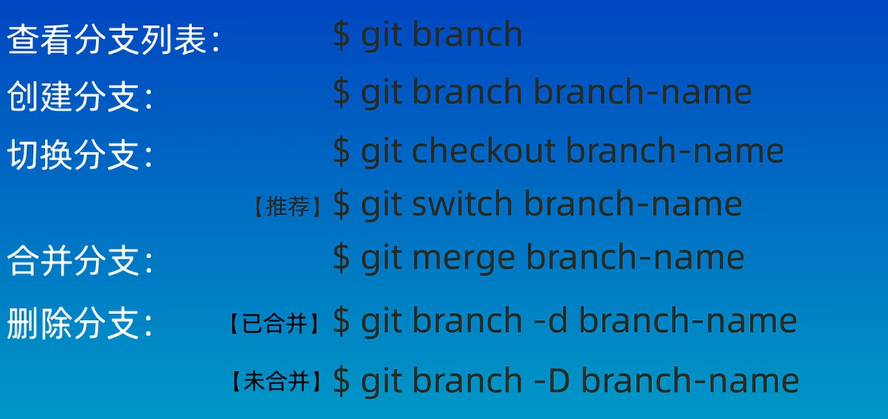

# [教程链接]( https://www.bilibili.com/video/BV1HM411377j/?share_source=copy_web&vd_source=173dc4182f0c7c29f23ed23f2ce5c5eb)
   
## git的使用方式

1. 命令行
   1. 终端
2. 图形化界面
   1. git官网
3. IDE插件/拓展
   1. 例如vscode

## git命令汇总

自己找一下

  
蓝色是当前目录，绿色是当前分支，~代表主目录

  
local --global --system

 
登入操作,保存登入，列出配置信息  

## 创建仓库
  
git init  和 git clone

\rm -rf .git 删除git目录

## git 的区域

## git 的文件状态
  

git status  

## git的reset命令
  

创建文件命令$ echo "这是第5个文件">file5.txt

head指针是什么？

git reflog 命令

## git diff命令

git diff 默认比较工作区和缓存区的不同
文档中可以按q键退出
git diff HEAD~3 HEAD 比较提交三个版本和当前版本的不同

## git rm删除文件
rm是linux的命令

## git ignore 忽略文件

 

# 远程厂库

远程厂库命令

第一次创建时需要创捷一个配置文件,用vim 命令即可

## 关联本地仓库和远程仓库

git pull(会合并分支) git fetch(不会)

## 分支简介和基本操作

分支的

  
