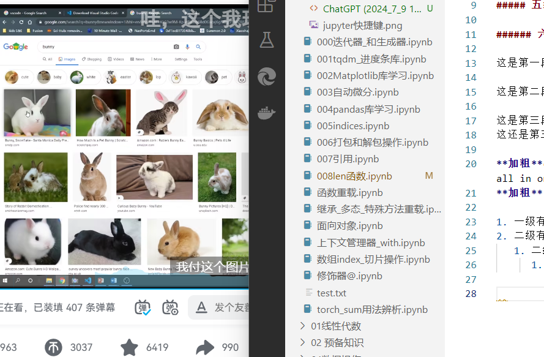

# 一级标题

## 二级标题

### 三级标题

#### 四级标题

##### 五级标题

###### 六级标题

这是第一段

这是第二段

这是第三段(后面有两个空格)  
这还是第三段

**加粗**ctrl+b  *斜体* ctrl+i(markdown all in one 插件功劳)  
**加粗**      *斜体*

1. 一级有序列表(记得空格)
2. 二级有序列表
   1. 二级有序列表(tab键)
      1. 三级列表

  
快捷键(ctrl+alt+v)这是标题

$$
  \lim_{x \to \infin}\frac{sinx}{x} = 0 公式快捷键ctrl+M两下
$$

$$
  \lim_{x \to \infin}\frac{sinx}{x} = 0
$$

这是一段文字插入公式$符号前最好要加一个空格 $\lim_{x \to \infin}\frac{sinx}{x} = 0$(ctrl+M一下)

## 表格  

| 大明  | ER     | EE    |
| ----- | ------ | ----- |
| first | second | third |


| 1     | 2      | 3     |
| ----- | ------ | ----- |
| first | second | third |

alt+shift+f 可以格式化变得好看

| 小明 | 耳鸣 | 大明  |
| :--- | ---: | :---: |
| 1.1  |  2.1 |  3.1  |


## 链接

这是一个[链接](https://www.bilibili.com/video/BV1si4y1472o/?spm_id_from=333.788.top_right_bar_window_history.content.click&vd_source=551eaf047c2dd2a3dbcb2c7e282fafc1) 

## 代码块

```python
   print(tab键上面的小撇号)
```
